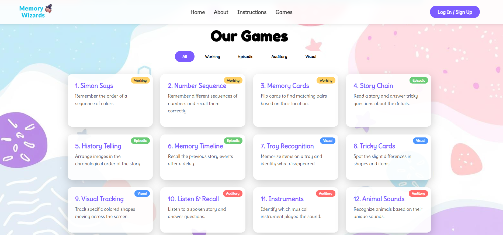
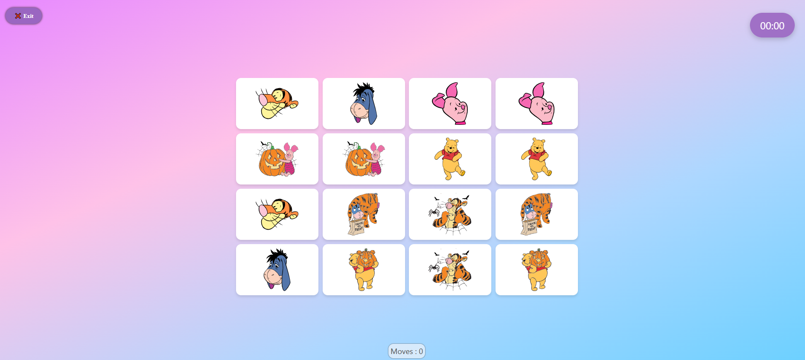
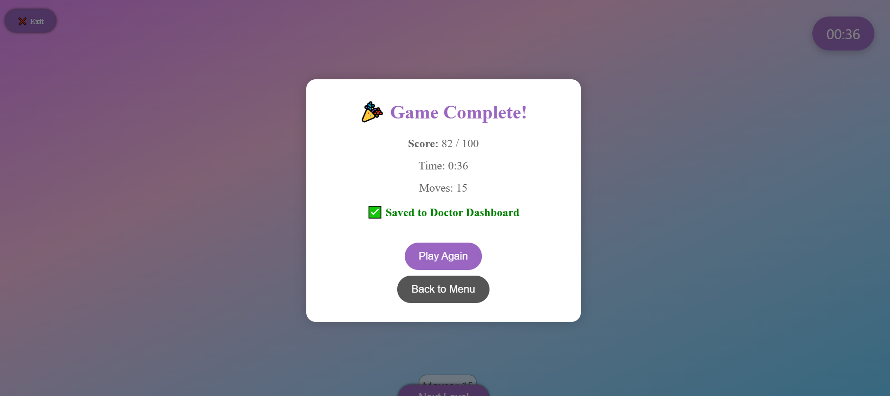
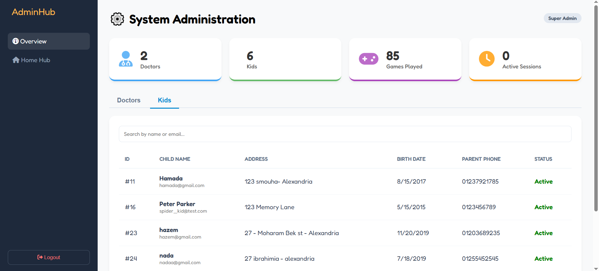
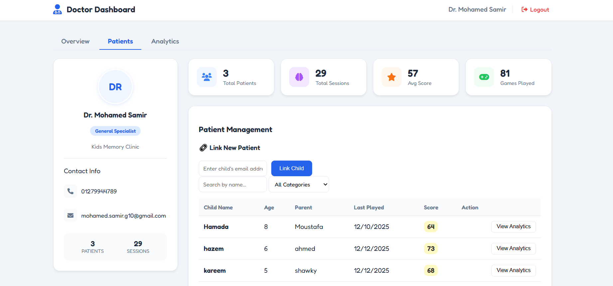
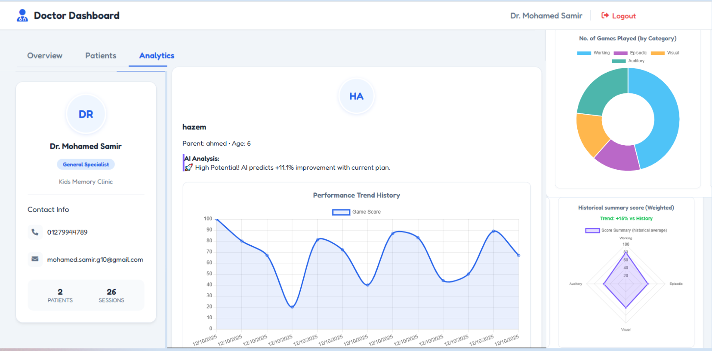

# 🧠 Kids Memory Test (Memory Wizards)

A web-based memory assessment and training platform designed to help **children**, **Doctors**, and **specialists** evaluate and improve memory skills through interactive games and structured tests.

---

## 📌 Table of Contents

* [About the Project](#about-the-project)
* [Problem Statement](#problem-statement)
* [Solution](#solution)
* [Features](#features)
* [Tech Stack](#tech-stack)
* [System Architecture](#system-architecture)
* [Installation & Setup](#installation--setup)
* [Database](#database)
* [Usage](#usage)
* [Screenshots](#screenshots)
---

## 📖 About the Project

**Kids Memory Test** is an educational and assessment platform that uses scientifically inspired memory games to help analyze and enhance children's cognitive abilities. The system can support specialists by providing structured results, insights based on children’s interactions and predicted percentage of enhancement using ML model.

---

## ❓ Problem Statement

Many parents and educators lack accessible tools to:

* Measure children’s memory performance accurately
* Track progress over time
* Present results in a structured and easy-to-understand way

Traditional methods are often manual, subjective, or not engaging for children.

---

## 💡 Solution

Kids Memory Test provides:

* Interactive memory games designed for children
* Automated scoring and evaluation
* Data storage for tracking results
* A user-friendly interface suitable for young users

---

## ✨ Features

* 🎮 Interactive memory games
* 🧩 Multiple difficulty levels
* 📊 Result tracking and evaluation
* 🧒 Child-friendly UI
* 🗄️ Database-backed test records
* 🤖 ML model to predicted percentage of enhancement  

---

## 🛠️ Tech Stack

### Frontend

* HTML5

* CSS3

* Vanilla JavaScript

### Backend

* ASP.NET Core 9 Web API

* Clean Architecture (N - Tier Architecture)

* Entity Framework Core (ORM)

* JWT Authentication

* BCrypt Password Hashing

### Database

* SQL Server 

* Stored Procedures (for session, score, and game management)

### Machine Learning

* Python

* Flask (ML Service API)

* NumPy, Pandas, Scikit-learn

### Tools & Platforms

* Git & GitHub

* Swagger UI

* Postman

* Visual Studio 2022 (Backend)

* VS Code (Frontend & ML)

---

## 🧱 System Architecture

The project follows a **Logically Layered Clean Architecture** implemented inside a single **ASP.NET Core 9 Web API** project. This approach provides enterprise-level structure while keeping the project manageable.

### 🔹 Architecture Layers
- **Presentation Layer (Controllers)**  
  Handles HTTP requests from the Frontend and returns responses.

- **Application Layer (Services / DTOs)**  
  Contains business logic such as authentication, session handling, JWT generation, and ML communication.

- **Domain Layer (Models)**  
  Represents core entities mapped to database tables (e.g., `User`, `GameSession`).

- **Infrastructure Layer (Data Access)**  
  Manages database connectivity using Entity Framework Core and SQL Server.

> EF Core scaffolding was used to generate models directly from existing SQL tables.

---

## 🔐 Backend Architecture & Security

### Authentication & Authorization

* DTOs (LoginDto, RegisterDto) used for secure data transfer

* Passwords hashed using BCrypt (never stored as plain text)

* JWT Tokens generated upon login to secure API endpoints

* API Exposure

* Swagger UI enabled for testing and documentation

* Authentication endpoints:

   * POST /register

   * POST /login

### CORS Configuration

* Enabled CORS to allow Frontend (port 5500) to communicate with Backend (port 7101)

---

## 🤖 Machine Learning Integration

* ML model hosted using Python Flask API

* Backend communicates with ML service via HTTP

* Workflow:

   1. Child completes a session

   2. Backend retrieves session scores from SQL Server

   3. Data sent to Flask ML service as JSON

   4. ML model predicts the percentage of enhancement on this plan

   5. Recommendation stored in database and sent to Frontend

---

## 🔗 Integration Strategy (System Handshake)

### Frontend ↔ Backend

* Protocol: REST over HTTP

* Security: JWT Tokens

* Token stored in `localStorage` and attached to every request

### Backend ↔ ML Service

* Protocol: HTTP (Server-to-Server)

* Backend uses `HttpClient` to communicate with Flask API

* ML responses persisted and reflected in UI

---

## ⚙️ Installation & Setup

Follow these steps to run the full system correctly (Database → Backend → ML Service → Frontend).

### 1️⃣ Clone the repository

```bash
git clone https://github.com/YourUsername/Kids-Memory-Test.git
```

```bash
cd Kids-Memory-Test
```

---

### 2️⃣ Database Setup 

1. Open **SQL Server Management Studio (SSMS)**, and execute the SQL script:
   ```
   Database/SQLQuery1.sql
   ```

This will create the required tables, stored procedures, and initial structure.

---

### 3️⃣ Run the Backend (.NET API)

1. Open the **Backend** folder in **Visual Studio 2022**
2. Ensure the connection string points to `KidsMemoryTestDB`
3. Run the project (HTTPS)

The backend will start on:
```
https://localhost:7101
```

You can verify it using **Swagger UI**:
```
https://localhost:7101/swagger
```

---

### 4️⃣ Run the Machine Learning Service (Flask API)

1. Navigate to the ML folder:
   ```bash
   cd ML
   ```
2. Install dependencies (first time only):
   ```bash
   pip install -r requirements.txt
   ```
3. Run the Flask application:
   ```bash
   python app.py
   ```

The ML service will start and listen for predictions from the backend.

---

### 5️⃣ Run the Frontend

1. Navigate to the Frontend folder
2. Open:
   ```
   home page/index.html
   ```
   in your browser

> ⚠️ Important: The frontend depends on both the Backend and ML services running.

---

## 🗄️ Database

* Database scripts are located in the `Database/` folder
* Main SQL file:

  * `SQLQuery1.sql`

You can execute the script using **SQL Server Management Studio (SSMS)**.

---

## ▶️ Usage

1. Launch the application
2. Start a memory game
3. Complete the test
4. Review results

---

## 🖼️ UI

### Home Page


### Memory Game


### Results Screen


### Admin Dashboard


### Doctor Dashboard


### Doctor Dashboard



⭐ If you find this project useful, feel free to star the repository!
